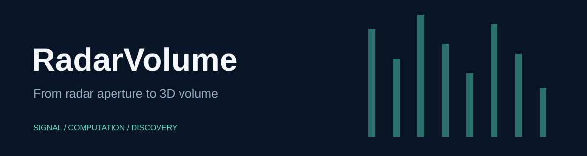

# RadarVolume

A MATLAB toolbox for MIMO synthetic-aperture radar imaging, channel calibration, and multistatic-to-monostatic conversion.

> **Development history:** Developed locally using Git before publication. These projects were published to GitHub together, so similar upload dates do not indicate when development began.

## Quick start

Open MATLAB in this repository, then use the branded entry point:

```matlab
calibrated = radar_volume(rawData, sensorParams, calData, delayOffset);
```

The entry point preserves the existing function's arguments, errors, and numerical output. Existing script and function names remain available for compatibility. No sensor starts when you open this repository.

## Inputs and workflows

Calibration input layout is channels × vertical scan × horizontal scan × chirp samples. sensorParams requires Slope_MHzperus, Sampling_Rate_ksps, Samples_per_Chirp. Reconstruction and array geometry use additional toolbox functions such as physconst; full reconstruction also requires suitable measured scan data. Calibration files and the tutorial are included.

## Verification

Run `run('tests/smoke_test.m')` from the repository root. See [verification details](docs/VERIFICATION.md) for the tested scope and unavailable checks. Computational source and bundled scientific assets are retained byte-for-byte; the added facade and documentation provide the new presentation.

## License

Institutional redistribution notices remain in the numerical files. MIT in LICENSE-branding covers only the new documentation, artwork, wrapper, and checks; it does not replace embedded source terms.
